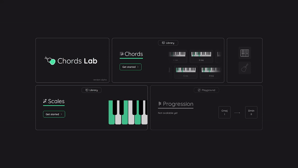

# Chords Lab

## About The Project - [Live Demo](https://chords-lab.vercel.app/)

Chords Lab is a web application that allows users explore musical scales and chords.
The project aims on creating all possible chords and scales based on the formulas for a given instrument.

## Built With

* Main framework - [React](https://reactjs.org/) with [Typescript](https://www.typescriptlang.org/)
* Styling using [Tailwindcss](https://tailwindcss.com/)
* Music theory library - [TonalJS](https://github.com/tonaljs/tonal)
* State management with [React Query](https://tanstack.com/query/v3/) and [Zustand](https://zustand-demo.pmnd.rs/)
* Animations made with [Framer Motion](https://www.framer.com/motion/)
* Build tool - [Vite](https://vitejs.dev/)
* Used UI primitives by [HeadlessUI](https://headlessui.com/) and [Radix](https://www.radix-ui.com/)
* Design in [Figma](https://www.figma.com/)

## License

All rights reserved
